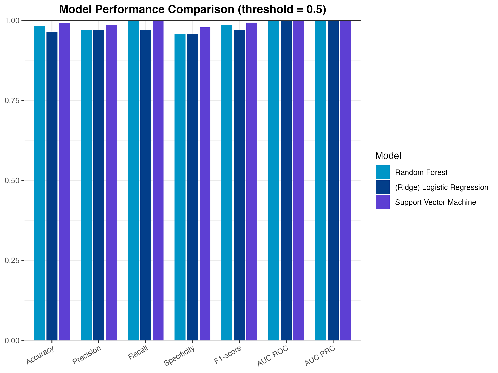

# ckdPrediction – Chronic Kidney Disease Prediction with Machine Learning

## Overview

**ckdPrediction** implements a complete, reproducible machine-learning workflow
for chronic kidney disease (CKD) prediction based on the **Kidney Disease Dataset**.

**Disclaimer:** The R package is only for study purpose, and **must not be used** for any real clinical decision making.

---

## Dataset

The package is designed around the publicly available [**Kidney Disease
Dataset** hosted on Kaggle by Akshay Singh](https://www.kaggle.com/datasets/akshayksingh/kidney-disease-dataset) (tabular clinical and laboratory measurements with a binary outcome
indicating CKD vs non-CKD).

The data set contains 26 features for each sample. Explanation for all features can be found in this essay.

The target variable is the factor `classification` with levels:

- `"ckd"` – chronic kidney disease present;
- `"notckd"` – chronic kidney disease absent.

---

## Installation

You can install the package from GitHub with either `devtools` or `remotes`.

```R
# Use remotes
install.packages("remotes")
remotes::install_github("YueweiXu-XJTLU/ckdPrediction")

# Use devtools
install.packages("devtools")
devtools::install_github("YueweiXu-XJTLU/ckdPrediction")
```

>  Note:
>
>  
>
>  - System requirements: R (>= 3.5.0)
>  - The packages imported are listed in the file “DESCRIPTION”

---

## Quick Start (Workflow)

The package exposes a complete pipeline for CKD prediction.

### 1. Data Pre-processing

```R
set.seed(123)
res <- data_process_ckd(
  system.file("extdata", "kidney_disease.csv", package="ckdPrediction"),
  row_threshold = 0.3,
  train_percentage = 0.7
)

head(res$train_df, 3)
head(res$test_df, 3)
head(res$row_missing_table, 3)
head(res$col_missing_table, 3)
```


---

### 2. Model Training

```R
set.seed(123)
train_df <- readRDS(system.file("extdata", "train_df.rds", package="ckdPrediction"))

rf_fit <- model_train_ckd(train_df, type = 1)
rf_fit

glm_fit <- model_train_ckd(train_df, type = 2)
glm_fit

svm_fit <- model_train_ckd(train_df, type = 3)
svm_fit
```


---

### 3. Prediction

- Predict Probabilities

  ```R
  set.seed(123)
  test_df <- readRDS(system.file("extdata", "test_df.rds", package="ckdPrediction"))
  svm_fit <- readRDS(system.file("extdata", "svm_fit.rds", package="ckdPrediction"))
  
  predict_prob <- predict_ckd(test_df, svm_fit)
  
  head(predict_prob)
  ```

  

- Predict Class Labels

  ```R
  set.seed(123)
  test_df <- readRDS(system.file("extdata", "test_df.rds", package="ckdPrediction"))
  svm_fit <- readRDS(system.file("extdata", "svm_fit.rds", package="ckdPrediction"))
  
  predict_class <- predict_class_ckd(test_df, svm_fit, threshold = 0.5)
  
  head(predict_class)
  ```

  

---

### 4. Model Evaluation

```R
set.seed(123)
test_df <- readRDS(system.file("extdata", "test_df.rds", package="ckdPrediction"))
svm_fit <- readRDS(system.file("extdata", "svm_fit.rds", package="ckdPrediction"))

ev <- model_evaluation_ckd(test_df, svm_fit, threshold = 0.5)

ev$metrics$accuracy
ev$metrics$cm
ev$curves$plot
ev$curves$auc
ev$best_threshold$info
ev$best_threshold$value
```


---

### 5. Model Interpretation

- Feature Importance

  ```R
  set.seed(123)
  train_df <- readRDS(system.file("extdata", "train_df.rds", package="ckdPrediction"))
  svm_fit <- readRDS(system.file("extdata", "svm_fit.rds", package="ckdPrediction"))
  
  rf_importance_plot <- model_interpretation_importance_ckd(train_df, svm_fit)
  
  rf_importance_plot
  ```
  
  
  
- SHAP

  ```R
  # This example is time & resource consuming, please wait for several minutes.
  set.seed(123)
  train_df <- readRDS(system.file("extdata", "train_df.rds", package="ckdPrediction"))
  test_df <- readRDS(system.file("extdata", "test_df.rds", package="ckdPrediction"))
  svm_fit <- readRDS(system.file("extdata", "svm_fit.rds", package="ckdPrediction"))
  
  plot_beeswarm <- model_interpretation_shap_ckd(
    train_df, 
    test_df, 
    svm_fit, 
    visualization_type = 1
  )
  plot_beeswarm
  
  plot_dependence <- model_interpretation_shap_ckd(
    train_df, 
    test_df, 
    svm_fit, 
    visualization_type = 2, 
    visualization_feature = "sc"
  )
  plot_dependence
  
  plot_waterfall <- model_interpretation_shap_ckd(
    train_df, 
    test_df, 
    svm_fit, 
    visualization_type = 3, 
    visualization_row = 1
  )
  plot_waterfall
  ```

---

### 6. Model Comparison

```R
set.seed(123)
test_df <- readRDS(system.file("extdata", "test_df.rds", package="ckdPrediction"))
rf_fit <- readRDS(system.file("extdata", "rf_fit.rds", package="ckdPrediction"))
glm_fit <- readRDS(system.file("extdata", "glm_fit.rds", package="ckdPrediction"))
svm_fit <- readRDS(system.file("extdata", "svm_fit.rds", package="ckdPrediction"))
model_list <- list(rf_fit, glm_fit, svm_fit)

plot <- model_comparison_ckd(model_list, test_df)

plot
```

---

## Model Performance

The plot summarised the robustness of our three models (under our recommended thresholds according to F1-Scores).

 

All models achieve consistently high values across accuracy, precision, recall, specificity, F1-score, AUC ROC, and AUC PRC, indicating that **the classifiers are robust and perform well on the held-out test set**.

The **support vector machine (SVM) model** shows the strongest overall discrimination, with both highest AUC ROC and AUC PRC. This suggests that it can reliably distinguish CKD-positive from CKD-negative patients even across a slight unbalanced dataset, and it is therefore recommended to be selected as the primary model for subsequent studies.

---

## License

MIT © Yuewei Xu

---

## Citation

If you use this package in articles, please cite:

`Yuewei Xu. (2025)   ckdPrediction – Chronic Kidney Disease Prediction with Machine Learning. GitHub: YueweiXu-XJTLU/ckdPrediction`

---

## Contact

Issues and feature requests: https://github.com/YueweiXu-XJTLU/ckdPrediction/issues

